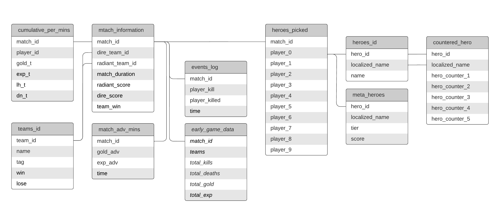

# Dota2-match-extraction

Extract and Transform data from Dota2, then loaded into csv for ..

get matches Dota2 matches data from [opendota](https://www.opendota.com/)

## Roadmap

- Move all file to github *Done*

- create datasets in kaggle (TI11 dataset)

- documents stuff (above)

- Refactor structure of code

- Optimize code

## What you need

## Schema & Data dictionary

## Authors

- [@booklyn](https://github.com/ta-brook)
